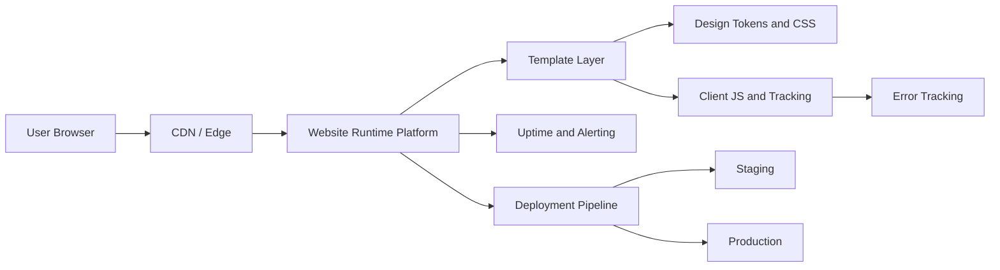

# Architecture Diagram

**Version:** 1.0  
**Owner:** Frontend Lead + Platform Owner  
**Last Updated:** 2026-05-06

## Objective
Provide a current-state and target-state architecture view for the HVAC program delivery path.

## Current-State (Implemented)

```mermaid
flowchart LR
    U[User Browser] --> T[HTML Templates]
    T --> C[system.css]
    T --> J[system.js]
    J --> A[Analytics Events]
    A --> G[GA4 (planned instrumentation)]
```

## Target-State (Pending Platform Provisioning)



## Open Decisions
- Runtime platform final selection (tracked in ADR-0001).
- Hosting provider and deployment target.
- Monitoring/error stack choice.

## Exit Criteria
- Platform selected and approved.
- Staging and production endpoints documented.
- Monitoring and alerting test evidence attached.
- Rollback drill evidence attached.
